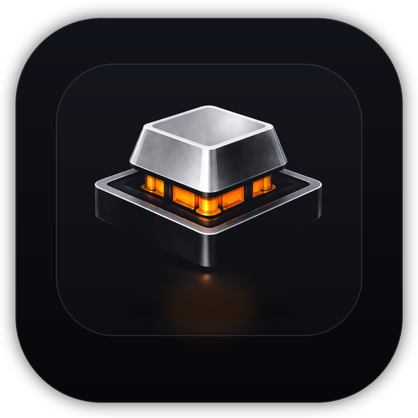

# Mecha

<p align="center">
  
</p>

<p align="center">
  <strong>Mechanical keyboard software for macOS.</strong><br />
  A native menu bar app that brings switch acoustics, sound packs, and low-latency playback to your Mac.
</p>

## What Mecha Is

Mecha is a macOS menu bar utility that plays mechanical keyboard sounds system-wide while you type. It is designed for people who want the feel of switch acoustics without changing their hardware, and for builders who want a cleaner foundation for pack research, sound normalization, and playback tuning.

The app is built in SwiftUI/AppKit and includes a native settings window, a low-latency audio engine, a switch-aware sound pack catalog, and tooling for importing and validating richer keyboard sound datasets.

## Highlights

- Native macOS menu bar app with no Dock presence during normal use
- Low-latency audio playback tuned for keyboard interaction
- Master output plus per-key-family acoustic mixer controls
- Structured sound pack catalog with brand, switch, and variant grouping
- Manifest v2 support for richer sample coverage and rendering hints
- Sound pack import, validation, and normalization tooling
- macOS-style settings UI and permissions onboarding
- Build and DMG scripts with centralized versioning

## How It Works

Mecha listens for keyboard events through macOS Accessibility APIs, maps those events into keyboard zones, then triggers preloaded samples through the audio engine with pack-specific rendering hints. The current codebase supports:

- legacy bundled packs
- imported multi-sample packs
- variant-aware catalog display
- spatial and timing hints in the playback pipeline
- a menu bar control surface for output, mixer, and sound pack selection

## Requirements

- macOS 14 or later
- Xcode Command Line Tools
- Accessibility permission so Mecha can hear global key events

## Build

```bash
bash ./build_mecha.sh
open ./build/Mecha.app
```

Each build bumps the patch version and build number through [`version.env`](./version.env) and [`scripts/versioning.sh`](./scripts/versioning.sh).

## Create A DMG

```bash
bash ./create_dmg.sh
```

## Project Layout

- [`Mecha/`](./Mecha): Swift source, app resources, sound packs, icons, and views
- [`SoundPipeline/`](./SoundPipeline): pack import, grouping, and normalization utilities
- [`Tests/`](./Tests): lightweight regression and validation checks
- [`docs/`](./docs): design notes and implementation planning docs
- [`raw_sources/`](./raw_sources): local research and reference material for pack exploration

## Audio Pack Direction

Mecha is moving toward a richer pack model that keeps audio variants distinct instead of flattening them away. The current tooling focuses on:

- preserving brand-level identity
- keeping switch variants separate when the recording context changes
- mapping multi-file upstream packs into keyboard zones
- validating coverage before shipping packs

## Acknowledgements

Mecha’s pack research and normalization work draws inspiration from the open mechanical keyboard sound community, including projects such as Wayvibes, Mechvibes, and Mechvibes DX.

## Status

This repository tracks the active macOS app and audio pipeline work. Expect the pack format, engine tuning, and release polish to keep improving as the sound library gets deeper.
